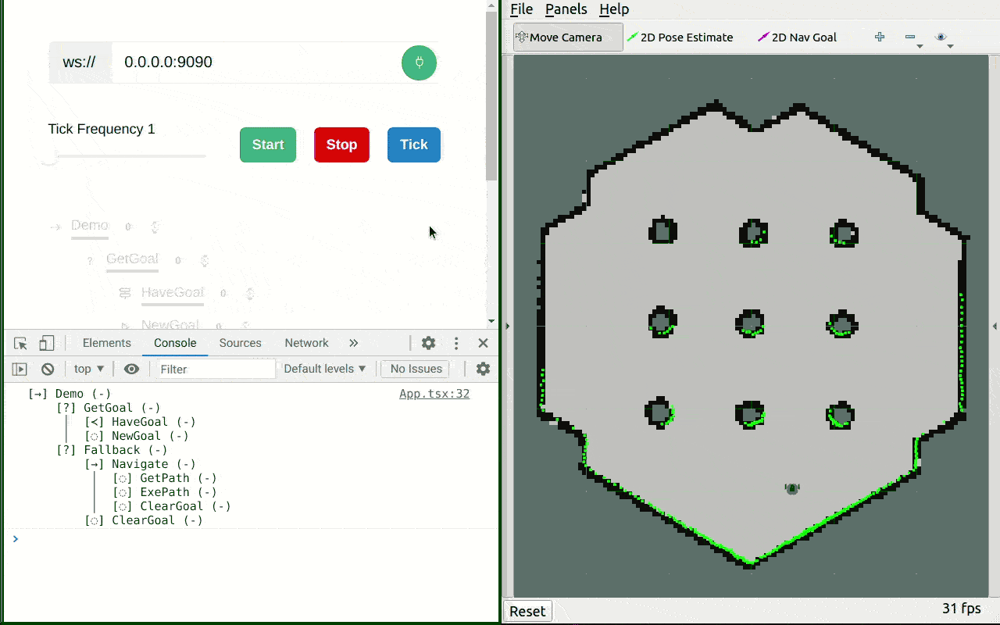

# JS Behavior Tree

Minimal behavior tree implementation in JavaScript

## Run Example
### Install ROS Dependencies
- [rosbridge](http://wiki.ros.org/rosbridge_suite)
- [move_base_flex](http://wiki.ros.org/move_base_flex)
- [turtlebot3_bringup](http://wiki.ros.org/turtlebot3_bringup)
- [turtlebot3_navigation](http://wiki.ros.org/turtlebot3_navigation)
- [turtlebot3_gazebo](https://wiki.ros.org/turtlebot3_gazebo)

### Install JS Dependencies
- `yarn install`

### Launch
- Use the launch file in example folder to launch gazebo and rosbridge server
  - `TURTLEBOT3_MODEL=burger roslaunch <path/to/example/launch/simulation.launch>`
- `yarn dev`

## Notes
- The example is ported from [Move Base Flex Tutorial](https://wiki.ros.org/move_base_flex/Tutorials/BehaviourTreesForMoveBaseFlex)
